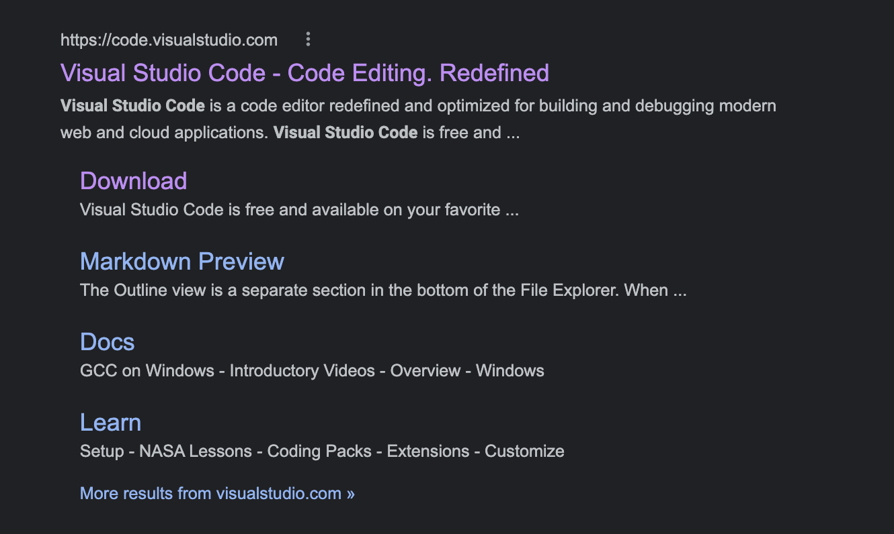
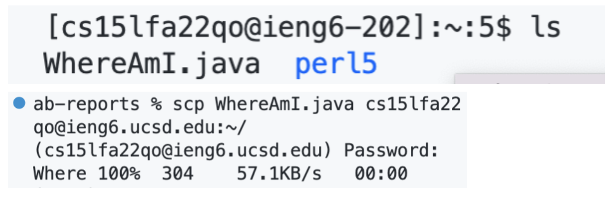

# Installing VScode
This step is relatively stright-forward.By googling the keyword VScode, you can see that the first result that pops up has a download option. Click on the download option, choose the best version of the studio code that fits into your computer.

# Remotely Connecting
By downloading the VScode,you now have the VScode downloaded in your computer. Open the VScode,and that open Terminal that is located on the top of the windows.In your terminal, you will type in the ssh command followed by the unique account given by school system in the format of cs15lfa22xx@ieng6.ucsd.edu where xx are the unique letters assigned to individuals.

# Trying Some Commands
There are plenty of commands that are available in the syntax of linux system.Here is a list of example commands:
* cd ~ : move to home directory
* cd: follow by a name of file, and move to that file 
* ls: list the current files in the directory
* pwd:get working directory path
* mkdir: make a new file 

You can explore more on this website[Some useful comments](https://www.digitalocean.com/community/tutorials/linux-commands)

For example, When I run touch command, I'm able to create an empty file.In this case, I created a file called xxx.

# Moving Files with scp
By using scp command, you can copy the file in your local computer to your remote server.The basic syntax is scp [file_name][account_name]:~/ in your terminal. Then there will be a password prompt to ask for your account password for the server. To check if the file is successfully copied and pasted to remote computer,you can try -ls command to see if the intended file is listed.

# Setting an SSH Key
SSH key is a way to avoid using password everytime to log back into the remote computer.On your cilent computer(your local computer), type in ssh-keygen command.When you see the prompt following by "Enter file in which to save the key ...", press enter twice.Now you have the private key and public key saved in your local computer  remotely.Now we need to log back into the server. On your server, type in mkdir .ssh, we are able to copy the public key to the server. Next time we try to connect to the server, we don't need to use password again as long as the private key and public key are matched.

# Optimizing Remote Running
One way to optimize remote running is by compiling programs directly in your own machine using ssh key.\
Here is when I compile the java program WhereAmI by logging into the server
.
Here is when I compile the java program directly in local computer by using ssh key + the file that I want to compile.\
.
Obviously,the second one is way more efficient than the first one.

